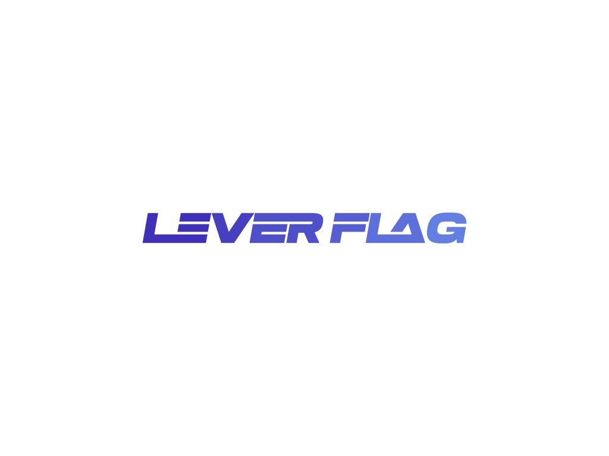

# LeverFlag

## **Optimizing Development Workflow: Introducing LeverFlag - A Feature Flag Management Service**

### **Description:**

Revolutionize your development process with our innovative Feature Flag Management Service. Seamlessly integrate feature flagging into your software development lifecycle to facilitate efficient and controlled feature releases. Our comprehensive platform empowers you to effortlessly manage feature flags, ensuring smooth deployments, improved collaboration, and unmatched flexibility.

### **Key Features:**

1. **Centralized Administration:** Our platform offers a centralized dashboard for creating, modifying, and monitoring feature flags across your entire application ecosystem. Eliminate the hassle of scattered configurations and enjoy streamlined control.

2. **Precise Control:** Fine-tune feature releases with precise control over audience targeting. Utilize feature flags to cater to specific user segments, geographical regions, or individual users, delivering personalized experiences while minimizing risks.

3. **Real-time Configuration:** Adapt quickly with real-time feature flag configurations. Toggle features on or off instantly, without requiring code deployments, enabling swift responses to evolving business needs or user feedback.

4. **Collaborative Workflow:** Foster collaboration across teams with collaborative workflow features. Share feature flag configurations easily, track changes, and gather feedback from stakeholders, ensuring seamless coordination among development, QA, and product management teams.

5. **Experimentation and A/B Testing:** Drive data-driven decisions with integrated experimentation and A/B testing capabilities. Experiment with different feature variations, measure their impact on key metrics, and iterate based on insights gained, all within our intuitive platform.

6. **Risk Management:** Safeguard your releases with effective risk mitigation strategies. Implement gradual rollouts, canary deployments, or dark launches to minimize the impact of potential issues, ensuring a smooth user experience.

7. **Performance Analysis:** Gain valuable insights into feature performance with comprehensive monitoring tools. Track metrics such as feature adoption rates, error rates, and user engagement, empowering you to optimize features for maximum impact.

8. **Security and Compliance:** Rest assured knowing that your feature flag configurations are secure and compliant. Benefit from robust security measures and audit trails to maintain data integrity and meet regulatory requirements effortlessly.

## **Why Choose Us:**

Our Feature Flag Management Service is tailored to accelerate your development cycle, enhance collaboration, and mitigate risks associated with feature releases. Supported by cutting-edge technology and unmatched customer service, we are committed to helping you deliver outstanding software experiences confidently.

Transform your development process today with our Feature Flag Management Service and maintain a competitive edge in the market.